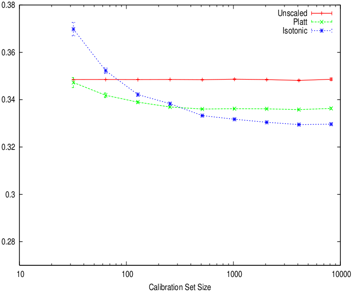
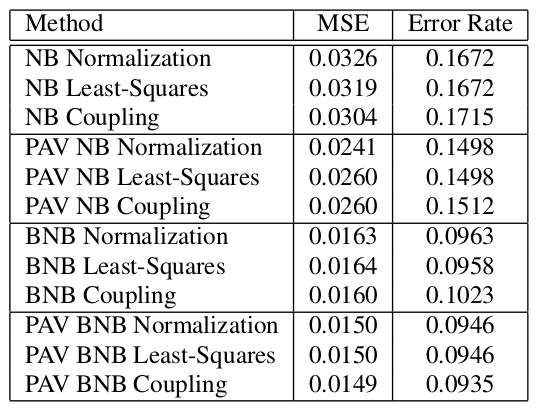
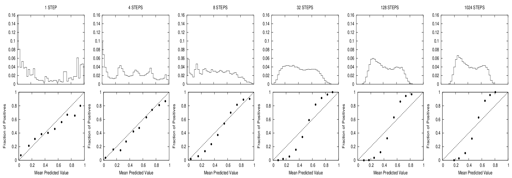

```{r setup, include=FALSE}
knitr::opts_chunk$set(echo = FALSE)
source('./utils.R')
```


# Overview

## The problem

\begin{columns}[t]
\begin{column}{0.48\textwidth}

\begin{block}{some classifiers produce well-calibrated probabilities}

\begin{itemize}
\item discriminant analysis
\item logistic regression
\end{itemize}

\end{block}
\end{column}


\begin{column}{0.48\textwidth}
\begin{block}{others don't}
\vspace{3mm}
\begin{itemize}
\item naive bayes
\item SVMs
\item anything with boosting
\item tree methods
\item sometimes neural networks
\end{itemize}
\end{block}

\end{column}
\end{columns}


## First of all, who cares?

1. people with asymmetric misclassification costs
\vspace{2mm}
2. people who are going to use the scores in post-processing
\vspace{2mm}
3. people who want to compare model outputs on a fair basis

## Definitions: "classification"

in general, a classifier is a mapping function $f$ such that 

$$f: \vec{x} \mapsto c$$ 

where $\vec{x} \in \mathbb{R}^{P}$, but we're mostly interested in the intermediate step in where the function produces some membership score $s_i$ for each instance $\vec{x}_i$

## Definitions: "well-calibrated"

- for a model $f$ and score $s_i$ to be well-calibrated for class $c_i$, the empirical probability of a correct classification $P(c_i | f( c_i | x_i)=s_i)$ must converge to $f(c_i | x_i) = s_i$
\vspace{5mm}
- **example**: when $s_i = 0.9$, the probability of a correct classification should converge to $P(c_i | s_i = 0.9) = 0.9$. Otherwise, this isn't \textit{really} a `probability.'

## Definitions: "calibration"

the calibration process is a separate mapping such that

$$g: s_i \mapsto P(c_i | s_i)$$

**it's really important to note that we're fitting another model on top of our model output, where your feature matrix is just the vector of probability scores $\vec{s}$ and the target variable is the vector of true class labels $\vec{y} \in \{0,1\}$**

# Visualizing calibration

## Visualizing calibration

\footnotesize
```{r, echo = TRUE, message=FALSE, warning=FALSE, cache = TRUE}
# train SVM w/ linear kernel on Pima Indian Diabetes data
m <- train(x = PimaIndiansDiabetes[,1:8],
           y = PimaIndiansDiabetes[,9], tuneLength = 1,
           method = 'svmLinear',
           trControl = trainControl(method = 'cv',
                                    savePredictions = T,
                                    classProbs = T))

pred <- m$pred[order(m$pred$rowIndex),]
result <- data.table(prob = pred$pos,
                     class = ifelse(pred$obs == 'pos', 1, 0))

```

## Visualizing calibration

plotting the model class score $s_i$ vs the true label $y_i$. Is this a useful representation?

```{r, cache = TRUE}
plot(x = result$prob, y = result$class, pch = '|',
     xlab = 'p(y = 1)', ylab = '', bty = 'n', yaxt = 'n')
```


## Reliability plots

**(1)** Bin predictions by $s_i$ (x-axis), **(2)** calculate $p(c_i)$ by bin (y-axis)

\footnotesize

```{r, cache = TRUE}
ReliabilityPlot(result$class, result$prob, bins = 10)
```

# Common methods

## Platt scaling

pass $s_i$ through the sigmoid

$$P(c_i | s_i) = \frac{1}{1 + \exp(As_i + B)}$$


where $A$ and $B$ are the solution to
$$\underset{A, B}{\operatorname{argmax}} - \sum\limits_{i} y_i \log(p_i) + (1 - y_i) \log(1- p_i)$$

## Platt scaling

applied to the Pima Indian Diabetes scores

```{r, cache = TRUE}

pmod <- train(x = result[,1], y = ifelse(result$class == 1, 'y', 'n'), family = 'binomial',
           method = 'glm', trControl = trainControl(method = 'cv',
                                                   savePredictions = TRUE,
                                                   classProbs = TRUE))

result[, platt_probs := pmod$pred[order(pmod$pred$rowIndex),4]]

plot(x = result$prob, y = result$class, pch = '|',
     xlab = 'p(y = 1)', ylab = '', bty = 'n', yaxt = 'n')

lines(y = sort(result$platt_probs), x = sort(result$prob), lwd = 4, col = 'red')
```

## Isotonic regression

a strictly-nondecreasing piecewise linear function $m$, where 
$$y_i = m(s_i) + \epsilon$$

fit such that

$$\hat{m} = {argmin}_z \sum_i{(y_i-z(s_i)) ^2}$$

## Isotonic regression

linear and isotonic regression fit to random noise with drift

```{r, cache = TRUE}
# noise with drift
x <- seq(200)
y <- seq(200) + rnorm(200, 0, 30)
#plot(x, y, bty = 'n', yaxt = 'n', xaxt = 'n', ylab = '', xlab = '')
```

```{r, cache = TRUE}
# fit with isotonic regression vs linear regression
plot(x, y, bty = 'n', yaxt = 'n', xaxt = 'n', ylab = '', xlab = '')
lines(isoreg(x,y), lwd = 4)
tmp <- lm(y ~ x)$coefficients
abline(a= tmp[1], b = tmp[2], lwd = 4, col = 'blue')
```

## Isotonic regression

applied to the Pima Indian Diabetes scores

```{r}
plot(x = result$prob, y = result$class, pch = '|',
     xlab = 'p(y = 1)', ylab = '', bty = 'n', yaxt = 'n')

lines(isoreg(result$prob, result$class), lwd = 4, col = 'red')

```

## Notes on applying calibration

- it's really easy to overfit
    + calibration partition
    + cross-validation

\vspace{1mm}

- isotonic regression is generally more flexible (and can closely approximate sigmoid)

\vspace{1mm}

- best technique is dependent on the family of model used to generate $s_i$

## Bootstrap aggregated isotonic regression

make it smoother by aggregating and averaging over 1000 resampled isotonic regression fits

```{r, cache = TRUE}
iso_mods1000 <- bootstrap_iso(result$prob, result$class, NBOOT = 10000, SAMP = 0.3)
iso_mods1 <- bootstrap_iso(result$prob, result$class, NBOOT = 1, SAMP = 1)

iso_pred <- predict_bootiso(iso_mods1000, result$prob)

plot(predict_bootiso(iso_mods1000, seq(0, 1, 0.001)), lwd = 4, type = 'l',  col = 'blue',
     xaxt = 'n', xlab = '', yaxt = 'n', ylab = '', bty = 'n')
lines(predict_bootiso(iso_mods1, seq(0, 1, 0.001)), lwd = 4, type = 'l', col = 'red')
```


# Extensions to $k > 2$

## Probabilistic classification as a simplex

-  if we view the task of probabilistic classification as a vector-valued function, we can visualize the co-domain of this task as assigning the location of a prediction in a regular (unit) simplex, $\Delta^{K-1}$
\vspace{2mm}
- why is this hard when $K > 2$?

## Probabilistic classification as a simplex

\begin{figure}
\begin{tikzpicture}
\node [above] at (0, 1.5) {$\Delta^{1}$};
\node [above] at (2.5, 1.5) {$\Delta^{2}$};
%\node [below] at (0, -.25) {line segment};
%\node [below] at (2.5, -.25) {triangle};

\draw [black, thick] (0, 0) -- (0, 1);
\draw [black, fill =black] (0, 0) circle [radius = 0.1];
\draw [black, fill =black] (0, 1) circle [radius = 0.1];
\draw [black, thick] (2, 0) -- (3, 0) -- (2.5, 0.87) -- (2,0);
\draw [black, fill = black](2, 0) circle [radius = 0.1];
\draw [black, fill = black](3, 0) circle [radius = 0.1];
\draw [black, fill = black](2.5, 0.87) circle [radius = 0.1];

\end{tikzpicture}
\end{figure}

trivial with $\Delta^{1}$ because we're only concerned with one unknown value and its complement. With $\Delta^{K>2}$ the simplex becomes a triangle, tetrahedron, five-cell, etc.

## Multi-class probability estimation

\begin{figure}
\begin{tikzpicture}
\draw [black] (-.5,-.5) rectangle (8, .5);
\draw [blue, fill =purple] (5.5,0) circle [radius = 0.2];
\draw [blue, fill =blue] (0,0) circle [radius = 0.2];
\draw [blue, fill =blue] (.5,0) circle [radius = 0.2];
\draw [blue, fill =blue] (1,0) circle [radius = 0.2];
\draw [blue, fill =red] (1.5,0) circle [radius = 0.2];
\draw [blue, fill =red] (2,0) circle [radius = 0.2];
\draw [blue, fill =red] (2.5,0) circle [radius = 0.2];
\draw [blue, fill =red] (3,0) circle [radius = 0.2];
\draw [blue, fill =orange] (3.5,0) circle [radius = 0.2];
\draw [blue, fill =orange] (4,0) circle [radius = 0.2];
\draw [blue, fill =purple] (4.5,0) circle [radius = 0.2];
\draw [blue, fill =purple] (5,0) circle [radius = 0.2];
\draw [blue, fill =purple] (5.5,0) circle [radius = 0.2];
\draw [blue, fill =purple] (6,0) circle [radius = 0.2];
\draw [blue, fill =purple] (6.5,0) circle [radius = 0.2];
\draw [blue, fill =purple] (7,0) circle [radius = 0.2];
\draw [blue, fill =purple] (7.5,0) circle [radius = 0.2];
\end{tikzpicture}
\caption {classification problem with $k = 4$}
\end{figure}

#### **Strategy:** decompose into separate binary classification problems

- one vs. all
- all pairs


## One vs. all

\begin{figure}
\begin{tikzpicture}
\draw [black] (-.5,-.5) rectangle (8, .5);
\node [above] at (0.5, .75) {\emph{one}};
\draw [->, thick] (0.5, .75) -- (0.5, .3);

\node [above] at (4.25, .75) {\emph{all}};
\draw [->, thick] (4.25, .75) -- (2.25, .3);
\draw [->, thick] (4.25, .75) -- (3.75, .3);
\draw [->, thick] (4.25, .75) -- (6, .3);


\draw [red, ultra thick] (-.25, -.25) rectangle (1.22, .25);
\draw [red, ultra thick] (1.27, -.25) rectangle (7.75, .25);
\draw [blue, fill =blue] (0,0) circle [radius = 0.2];
\draw [blue, fill =blue] (.5,0) circle [radius = 0.2];
\draw [blue, fill =blue] (1,0) circle [radius = 0.2];
\draw [blue, fill =red] (1.5,0) circle [radius = 0.2];
\draw [blue, fill =red] (2,0) circle [radius = 0.2];
\draw [blue, fill =red] (2.5,0) circle [radius = 0.2];
\draw [blue, fill =red] (3,0) circle [radius = 0.2];
\draw [blue, fill =orange] (3.5,0) circle [radius = 0.2];
\draw [blue, fill =orange] (4,0) circle [radius = 0.2];
\draw [blue, fill =purple] (4.5,0) circle [radius = 0.2];
\draw [blue, fill =purple] (5,0) circle [radius = 0.2];
\draw [blue, fill =purple] (5.5,0) circle [radius = 0.2];
\draw [blue, fill =purple] (6,0) circle [radius = 0.2];
\draw [blue, fill =purple] (6.5,0) circle [radius = 0.2];
\draw [blue, fill =purple] (7,0) circle [radius = 0.2];
\draw [blue, fill =purple] (7.5,0) circle [radius = 0.2];
\end{tikzpicture}
\caption {\emph{one vs. all} reduces to $k-1$ calibrations}
\end{figure}

## All pairs

\begin{figure}
\begin{tikzpicture}
\draw [black] (-.5,-.5) rectangle (8, .5);
\node [above] at (0.5, .75) {$c_i$};
\draw [->, thick] (0.5, .75) -- (0.5, .3);

\node [above] at (2.25, .75) {$c_j$};
\draw [->, thick] (2.25, .75) -- (2.25, .3);

\draw [red, ultra thick] (-.25, -.25) rectangle (1.22, .25);
\draw [red, ultra thick] (1.27, -.25) rectangle (3.25, .25);
\draw [blue, fill =blue] (0,0) circle [radius = 0.2];
\draw [blue, fill =blue] (.5,0) circle [radius = 0.2];
\draw [blue, fill =blue] (1,0) circle [radius = 0.2];
\draw [blue, fill =red] (1.5,0) circle [radius = 0.2];
\draw [blue, fill =red] (2,0) circle [radius = 0.2];
\draw [blue, fill =red] (2.5,0) circle [radius = 0.2];
\draw [blue, fill =red] (3,0) circle [radius = 0.2];
\draw [blue, fill =orange] (3.5,0) circle [radius = 0.2];
\draw [blue, fill =orange] (4,0) circle [radius = 0.2];
\draw [blue, fill =purple] (4.5,0) circle [radius = 0.2];
\draw [blue, fill =purple] (5,0) circle [radius = 0.2];
\draw [blue, fill =purple] (5.5,0) circle [radius = 0.2];
\draw [blue, fill =purple] (6,0) circle [radius = 0.2];
\draw [blue, fill =purple] (6.5,0) circle [radius = 0.2];
\draw [blue, fill =purple] (7,0) circle [radius = 0.2];
\draw [blue, fill =purple] (7.5,0) circle [radius = 0.2];
\end{tikzpicture}
\caption {\emph{all pairs} reduces to ${K}\choose{2}$ calibrations}
\end{figure}

## Combining multi-class probability estimates

- least squares: minimize squared error loss w/ non-negativity
\vspace{2mm}
- coupling (only *all pairs*): minimize log loss w/ non-negativity
\vspace{2mm}
- normalization (only *one vs all*): divide by sum of probabilities estimates

# Experimental results

## effect of calibration set size

\footnotesize
from Niculescu-Mizil and Caruana, 2005



## effect of multi-class combination method

\footnotesize
from Zadrozny and Elkan, 2002



## boosting causes calibration issues

\footnotesize
from Niculescu-Mizil and Caruana, 2005



# Conclusion

## References

- **[Multivariate calibration of classifier scores into the probability space](https://www.researchgate.net/publication/28358301_Multivariate_calibration_of_classifier_scores_into_the_probability_space)** by Martin Gebel

- **[Transforming Classifier Scores into Accurate Multiclass Probability Estimates](https://www.google.com/url?sa=t&rct=j&q=&esrc=s&source=web&cd=4&cad=rja&uact=8&ved=0ahUKEwit7-7h9f7UAhVl6IMKHUPeB2oQFghDMAM&url=http%3A%2F%2Fwww.cs.cornell.edu%2Fcourses%2Fcs678%2F2007sp%2FZadroznyElkan.pdf&usg=AFQjCNEsN8dbe1yXCm7D7qkyrP6HZ6yOxg)** by Zadrozny and Elkan

- **[Obtaining Calibrated Probabilities from Boosting](http://www.cs.cornell.edu/~caruana/niculescu.scldbst.crc.rev4.pdf)** by Niculescu-Mizil and Caruana

- **[Predicting Good Probabilities With Supervised Learning](https://www.google.com/url?url=http://scholar.google.com/scholar_url%3Furl%3Dhttp://machinelearning.wustl.edu/mlpapers/paper_files/icml2005_Niculescu-MizilC05.pdf%26hl%3Den%26sa%3DX%26scisig%3DAAGBfm1wOIFZHQSONJ4oLiHQyqALiSVCng%26nossl%3D1%26oi%3Dscholarr&rct=j&q=&esrc=s&sa=X&ved=0ahUKEwiOotzS9v7UAhXr8YMKHZI8CGsQgAMIJygAMAA&usg=AFQjCNG3rc7DzDTTox-DD_xm9hwrC5VVQA)** by Niculescu-Mizil and Caruana

